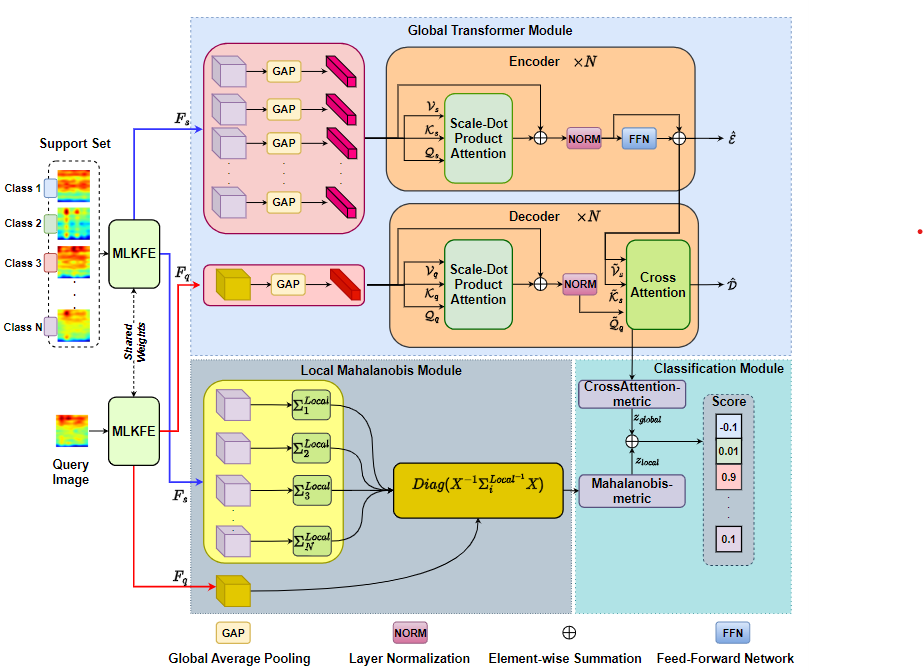
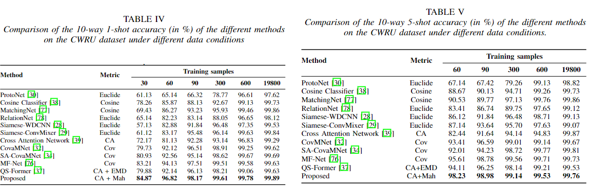
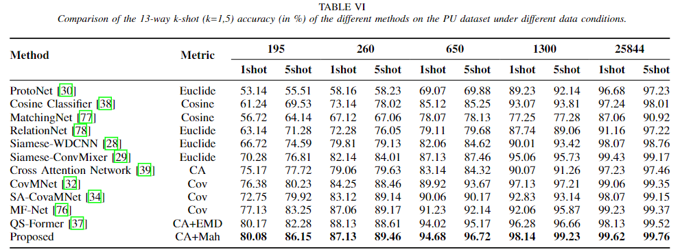

# Few-shot-via-ensembling-Transformer-with-Mahalanobis-distance

[Link to paper](https://ieeexplore.ieee.org/document/10478558)

We provide a Pytorch implement code of paper "Few-Shot Bearing Fault Diagnosis via Ensembling
Transformer-based Model with Mahalanobis
Distance Metric Learning from Multiscale Features" accepted by IEEE Transactions on Instrumentation and Measurement.



## Prerequisites
- Python 3
- Linux
- Pytorch 0.4+
- GPU + CUDA CuDNN
## Dataset
In this paper, we ultilize 2 datasets: [CWRU](https://engineering.case.edu/bearingdatacenter) and [PU](https://mb.uni-paderborn.de/kat/forschung/kat-datacenter/bearing-datacenter/data-sets-and-download). 

Note, if you use these datasets, please cite the corresponding papers. (Feel free to contact me if you need PU dataset in .pt file)

## Getting Started
- Installation
``` bash
git clone https://github.com/HungVu307/Few-shot-via-ensembling-Transformer-with-Mahalanobis-distance
```
- Training for 1 shot
``` bash
python train_1shot.py --dataset 'CWRU' --training_samples_CWRU 30 --training_samples_PDB 195 --model_name 'Net'
```
- Testing for 1 shot
```bash
python test_1shot.py --dataset 'CWRU' --best_weight 'PATH TO BEST WEIGHT'
```
- Training for 5 shot
``` bash
python train_5shot.py --dataset 'CWRU' --training_samples_CWRU 60 --training_samples_PDB 300 --model_name 'Net'
```
- Testing for 5 shot
```bash
python test_5shot.py --dataset 'CWRU' --best_weight 'PATH TO BEST WEIGHT'
```
- Result
1. CWRU dataset

1. PU dataset


## Contact
Please feel free to contact me via email hung.vm195780@sis.hust.edu.vn or vumanhhung07.work@gmail.com if you need anything related to this repo!
## Citation
If you feel this code is useful, please give us 1 ⭐ and cite our paper.
```bash
@article{vu2024few,
  title={Few-Shot Bearing Fault Diagnosis via Ensembling Transformer-based Model with Mahalanobis Distance Metric Learning from Multiscale Features},
  author={Vu, Manh-Hung and Nguyen, Van-Quang and Tran, Thi-Thao and Pham, Van-Truong and Lo, Men-Tzung},
  journal={IEEE Transactions on Instrumentation and Measurement},
  year={2024},
  publisher={IEEE}
}
```